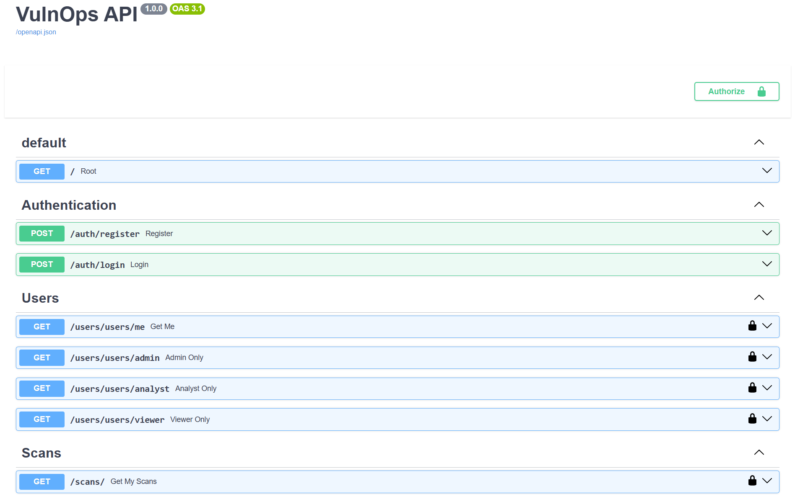
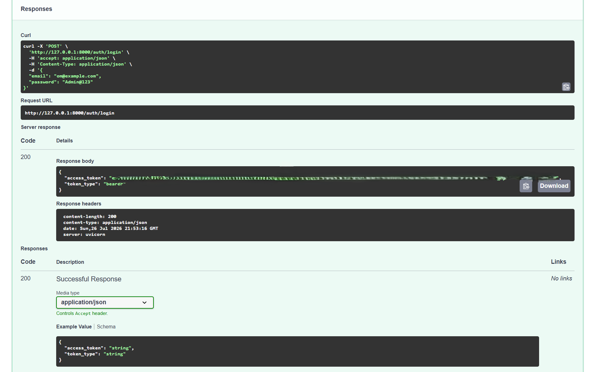
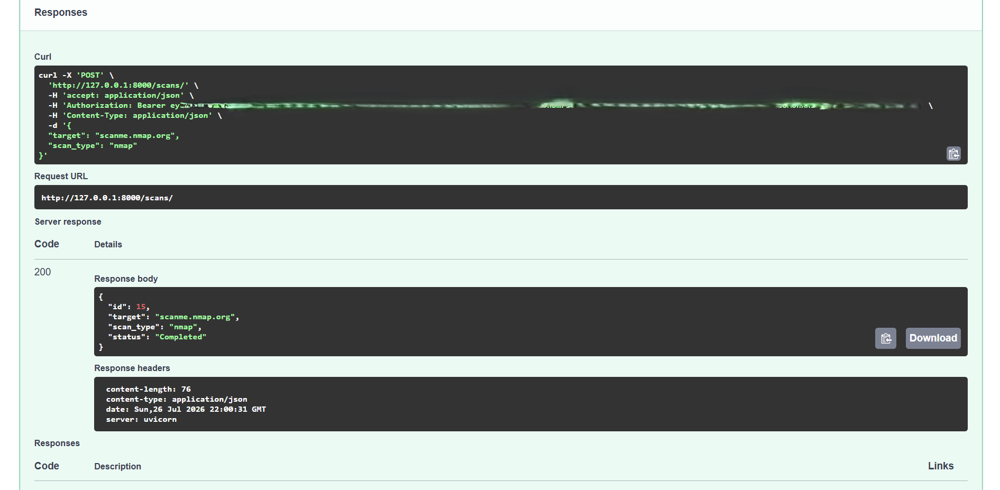
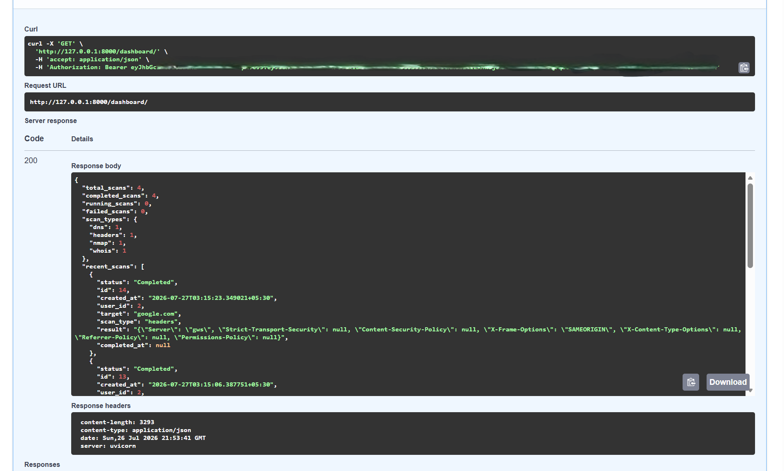

# VulnOps

A cybersecurity vulnerability management platform built with FastAPI, PostgreSQL, SQLAlchemy, JWT Authentication, and Docker.

## Features

- JWT Authentication
- Role-Based Access Control (Admin, Analyst, Viewer)
- Nmap Port Scanner
- WHOIS Scanner
- DNS Scanner
- HTTP Security Headers Scanner
- Dashboard Analytics
- PostgreSQL Database
- Docker Support
- Swagger API Documentation

---

## Tech Stack

- FastAPI
- PostgreSQL
- SQLAlchemy
- Alembic
- JWT
- Docker
- Python

---

## Project Structure

```
vulnops/
│
├── backend/
├── frontend/
├── docker/
├── assets/
├── README.md
└── requirements.txt
```

---

## Installation

```bash
git clone https://github.com/OmMane2003/VulnOps.git

cd VulnOps

pip install -r requirements.txt

uvicorn app.main:app --reload
```

---

## API Documentation

Open Swagger UI:

```
http://127.0.0.1:8000/docs
```

---

## Screenshots

### Swagger API



---

### Login



---

### Create Scan



---

### Dashboard



---

## Future Improvements

- React Dashboard
- Scan Scheduling
- PDF Report Generation
- Email Notifications
- CVE Integration
- Risk Scoring

---

## License

MIT License
